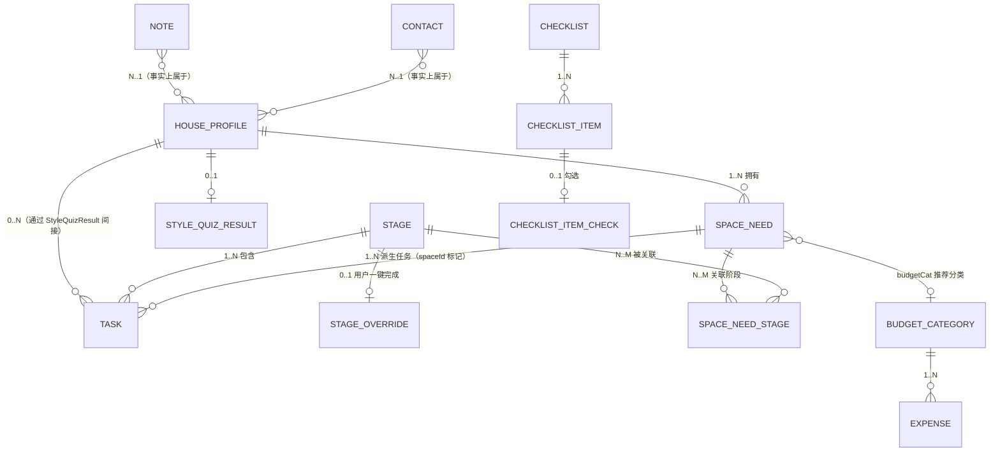

# Research: Room schema 规划（Android 端口）

- **Query**: 从 `js/storage.js` 反推 Android Room 表 / DAO 设计；覆盖房屋信息、阶段、任务、预算分类、支出、联系人、笔记、设置项。
- **Scope**: internal（仅仓库内 `js/**` 与 `.trellis/tasks/08-28-android-port/prd.md` 静态阅读，无外部检索）
- **Date**: 2026-08-29
- **读取来源**:
  - `js/storage.js`（`window.Store`，`Store.state` 形状与持久化）
  - `js/app.js`（阶段 / 任务 / 整体进度派生逻辑，向导写回 profile/budget/spaces）
  - `js/views/home.js`（首页"逾期 / 今天 / 未来 7 天"分组、预算汇总、超支检测）
  - `js/views/stages.js`（阶段展开、任务勾选、整段 override、taskDates）
  - `js/views/budget.js`（分类聚合、超支判定、CSV 导出扁平视图）
  - `js/views/more.js`（笔记 / 联系人 / 空间需求 CRUD）
  - `js/views/guide.js`（验收清单勾选 `state.checks`、风格测试 `state.quiz`）
  - `js/data/knowledge.js`（只读目录：14 阶段、checklists、styles、modes、spaceNeeds）
  - `js/data/prices.js`（只读目录：tiers、grades、rates、`budgetTemplate()` 输出形状）
  - `.trellis/tasks/08-28-android-port/prd.md`（移植目标与技术决策 D1/D2）

---

## 1. Web 端 `Store.state` 字段清单

`Store.state` 持久化在 `localStorage[KEY='zhuangxiu_guanjia_v1']`（storage.js:3, :58-61）。下表是当前形态反推结果，可作为 Room 表 / 字段的"事实源"。

| 字段 | 类型（Web 形态） | 出现处 | 是否需要 Room 表 | 说明 |
|---|---|---|---|---|
| `ver` | `number` | storage.js:6, :8 | 否（仅放 `schema_version` 元信息） | 备份文件版本号，Android 端用 Room `@Database(version = ...)` 替代 |
| `profile` | `object \| null` | storage.js:9, app.js:335-341, more.js:13-30 | **HouseProfile** | `{area, tier, mode, grade, startDate, totalBudget, styleId, createdAt}` |
| `tasksDone` | `{ [taskId: string]: true }` | storage.js:10, app.js:20, home.js:88/103, stages.js:220-221 | **TaskCompletion**（或合并到 `tasks` 表的 `done` 列） | 任务勾选；key = 阶段静态任务 `stage.tasks[i].id` 或 `customTasks[i].id` |
| `taskDates` | `{ [taskId: string]: 'YYYY-MM-DD' }` | storage.js:11, stages.js:256-263, home.js:87-94 | **TaskSchedule**（或合并 `Task.dueDate`） | 计划日期；首页"待办提醒"按 `dueDate - today` 排序 |
| `customTasks` | `Array<{id, stageId, text, spaceId?, date?}>` | storage.js:12, app.js:11-14, storage.js:142 | **Task**（type=CUSTOM / DERIVED_FROM_SPACE） | 用户自建任务 + 由空间需求派生的任务；派生任务的 `spaceId` 标记来源 |
| `stageOverride` | `{ [stageId: string]: 'done' }` | storage.js:13, app.js:21, stages.js:298/303 | **StageProgress**（`overrideDone` 列） | 用户"一键完成整个阶段"；未在 map 中表示"未 override" |
| `budget.categories` | `Array<{id, name, emoji, planned?}>` | storage.js:14, budget.js:69-99, prices.js:59-94 | **BudgetCategory** | 预算分类；web 形态 `id` 多为模板前缀（`b-construct` 等），也允许 `bc_xxx` 自建 |
| `budget.expenses` | `Array<{id, name, amount, catId, date, note?}>` | storage.js:14, budget.js:14-22/198-202 | **Expense** | 支出条目；`catId` 外键到 `BudgetCategory.id` |
| `checks` | `{ [checklistItemId: string]: true }` | storage.js:15, guide.js:86/95/288-289 | **ChecklistItemCompletion**（或合并到 checklist_items 表 `done`） | 验收清单条目勾选；key = `DATA.checklists[i].items[j].id`（如 `w-1`） |
| `notes` | `Array<{id, title, text, updatedAt}>` | storage.js:16, more.js:59-66/190-194 | **Note** | 笔记 |
| `contacts` | `Array<{id, name, role, phone, note}>` | storage.js:17, more.js:74-82/217-221 | **Contact** | 联系人 |
| `spaces` | `Array<{id, presetId, name, emoji, desc, stageIds[], tasks:[{stageId,text}], budgetCat, budgetNote, custom, createdAt}>` | storage.js:19, app.js:369-413, more.js:39-50/300-332 | **SpaceNeed** + 关系表 **SpaceNeedStage** | 空间需求；`stageIds[]`、`tasks[].stageId` 在 Android 端可用关联表建模 |
| `quiz` | `{styleId, at} \| null` | storage.js:20, guide.js:212 | **HouseProfile**（合并 `styleId`+`styleQuizAt`） 或独立 **StyleQuizResult** | 风格测试最近结果；`styleId` 已存在于 `profile.styleId`，`at` 需新字段 |

### 派生（非持久化，但需要 ViewModel/查询还原）

| 派生量 | 计算点 | Android 实现 |
|---|---|---|
| `stageProgress(stage).{total, done, pct, isDone, overridden}` | app.js:17-30 | `StageProgressView` 视图：JOIN `tasks` + `stageOverride`，GROUP BY stageId |
| `allProgress()` | app.js:42-49 | 全局 `SELECT SUM(done), SUM(total)` |
| `currentStage()` | app.js:32-40 | `SELECT s.* FROM stages s ORDER BY (pct<100) LIMIT 1` |
| `overdue / today / upcoming7` 任务分组 | home.js:82-96, :138-144 | 按 `dueDate` 与 `today` 比较的查询 |
| 分类超支判定 | budget.js:77-78, home.js:172-174 | 视图 `CategoryWithSpent`：JOIN `expenses` GROUP BY catId，HAVING `SUM(amount) > planned` |
| 支出时间倒序 | budget.js:132 | `SELECT * FROM expenses ORDER BY date DESC, id DESC` |
| CSV 导出扁平视图 | budget.js:222-238 | `ExpenseExportView` 视图：JOIN `budget_categories` 取分类名 |
| 派生任务的"保留为普通任务"判定 | storage.js:121-144 | `Task.spaceId IS NULL OR tasks_done[t.id] = true`（删除空间时，已勾卡的派生任务清除 spaceId） |

---

## 2. 实体关系（ER 草图）



> **注意**：Web 端 `Store.state` 是单 `profile`、单 `tasksDone` map、共享 `categories`/`expenses` 等——本质是"单租户、所有数据挂在一个 profile 下"。Android v1 也按此建模，**不引入多套房屋**，但留扩展位（见 §7 Migration）。

---

## 3. Room 表与列定义

每张表给出列、类型、约束、索引，以及对应的 Web `Store.state` 字段。仅 v1 草案，**不写 Kotlin 代码**，仅以伪 SQL / 数据类字段形式呈现。

### 3.1 `house_profile`（房屋信息 + 设置）

- **对应 Web 字段**：`state.profile` + `state.quiz`（`styleId`/`at`）
- **特殊**：单行表（应用只持有一套房屋）—— 用 `PRIMARY KEY = 1` 强制单行（Android Room 单例行惯用法）。

| 列 | SQL 类型 | 约束 / 索引 | 对应 Web 字段 | 备注 |
|---|---|---|---|---|
| `id` | INTEGER | PK, CHECK(id=1) | — | 强制单行 |
| `area_m2` | REAL | NOT NULL | `profile.area` | 建筑面积 |
| `tier_id` | TEXT | NOT NULL | `profile.tier` | 一线 / 新一线 / 二线 / 三四线（`t1`/`nt1`/`t2`/`t3`） |
| `mode_id` | TEXT | NOT NULL | `profile.mode` | `clear` / `half` / `full` / `whole` |
| `grade_id` | TEXT | NOT NULL | `profile.grade` | `eco` / `mid` / `high` |
| `start_date` | TEXT | NULL | `profile.startDate` | `YYYY-MM-DD`，`null` 表示未设置 |
| `total_budget_cents` | INTEGER | NOT NULL | `profile.totalBudget` | 总预算；**建议用分（cents）存整数**，避免浮点累计误差；导入时 `× 100` |
| `style_id` | TEXT | NULL | `profile.styleId` | 风格目录 id（`modern`/`nordic`/...），见 `DATA.styles` |
| `style_quiz_at` | TEXT | NULL | `quiz.at` | 最近一次风格测试时间；`null` 表示未做 |
| `created_at` | TEXT | NOT NULL | `profile.createdAt` | `YYYY-MM-DD` |

**CREATE TABLE 草案**

```sql
CREATE TABLE house_profile (
  id              INTEGER PRIMARY KEY NOT NULL CHECK (id = 1),
  area_m2         REAL    NOT NULL,
  tier_id         TEXT    NOT NULL,
  mode_id         TEXT    NOT NULL,
  grade_id        TEXT    NOT NULL,
  start_date      TEXT,
  total_budget_cents INTEGER NOT NULL,
  style_id        TEXT,
  style_quiz_at   TEXT,
  created_at      TEXT    NOT NULL
);
```

> **不存**：`ver`（用 Room `version` 替代）、`storageOk`（Android 端 DataStore 失败抛异常即可）。

---

### 3.2 `stage`（14 个阶段）

- **对应 Web 字段**：`DATA.stages`（只读目录，Android 端在 `assets/knowledge.json` 一次写入）
- **特殊**：v1 阶段目录是只读种子数据。Room 表用于支持"阶段名/工期"等可能演进。

| 列 | SQL 类型 | 约束 / 索引 | 对应 Web 字段 | 备注 |
|---|---|---|---|---|
| `id` | TEXT | PK | `stage.id` | 字符串主键，如 `inspect` / `water-electric` |
| `phase` | TEXT | NOT NULL | `stage.phase` | 阶段分组（"准备阶段" / "硬装施工" / "安装阶段" / "入住收尾"） |
| `emoji` | TEXT | NOT NULL | `stage.emoji` | |
| `name` | TEXT | NOT NULL | `stage.name` | |
| `duration` | TEXT | NOT NULL | `stage.duration` | 工期文案（保留为 i18n 友好字符串） |
| `goal` | TEXT | NOT NULL | `stage.goal` | |
| `order_index` | INTEGER | NOT NULL, UNIQUE | 数组下标 | 显式存顺序，避免依赖 `id` 字典序 |
| `warnings_json` | TEXT | NOT NULL | `stage.warnings` | `JSONArray<String>` 序列化 |
| `buy_json` | TEXT | NOT NULL | `stage.buy` | `JSONArray<{item,note}>` |
| `accept_ids_json` | TEXT | NOT NULL | `stage.acceptIds` | `JSONArray<String>`（如 `["cl-water"]`） |

**CREATE TABLE 草案**

```sql
CREATE TABLE stage (
  id              TEXT PRIMARY KEY NOT NULL,
  phase           TEXT NOT NULL,
  emoji           TEXT NOT NULL,
  name            TEXT NOT NULL,
  duration        TEXT NOT NULL,
  goal            TEXT NOT NULL,
  order_index     INTEGER NOT NULL UNIQUE,
  warnings_json   TEXT NOT NULL DEFAULT '[]',
  buy_json        TEXT NOT NULL DEFAULT '[]',
  accept_ids_json TEXT NOT NULL DEFAULT '[]'
);
CREATE INDEX idx_stage_order ON stage(order_index);
```

> **不存**：`tasks` 子表（见下节 3.3）：静态任务的文案是知识库一部分，单独建 `task_template`。

---

### 3.3 `task_template`（阶段内置任务 / 静态任务文案）

- **对应 Web 字段**：`DATA.stages[i].tasks[j] = {id, text, tip?}`
- **特殊**：只读种子数据，V1 通过 `assets/knowledge.json` 一次性写入。

| 列 | SQL 类型 | 约束 / 索引 | 对应 Web 字段 | 备注 |
|---|---|---|---|---|
| `id` | TEXT | PK | `task.id` | 全局唯一，如 `inspect-1` / `we-6` |
| `stage_id` | TEXT | FK→`stage.id`, NOT NULL | `task` 所属 stage | |
| `order_index` | INTEGER | NOT NULL | 数组下标 | 阶段内排序 |
| `text` | TEXT | NOT NULL | `task.text` | |
| `tip` | TEXT | NULL | `task.tip` | 任务小贴士（可选） |

**CREATE TABLE 草案**

```sql
CREATE TABLE task_template (
  id          TEXT PRIMARY KEY NOT NULL,
  stage_id    TEXT NOT NULL REFERENCES stage(id) ON DELETE CASCADE,
  order_index INTEGER NOT NULL,
  text        TEXT NOT NULL,
  tip         TEXT
);
CREATE INDEX idx_task_template_stage ON task_template(stage_id, order_index);
```

> **外键策略**：当 stage 目录更新时（CASCADE 重建）级联清掉。

---

### 3.4 `task`（用户任务 / 含勾选与计划日期）

- **对应 Web 字段**：`state.customTasks` + `state.tasksDone` + `state.taskDates`（**三合一**）
- **设计要点**：把"勾选 map"和"日期 map"内联为列；通过 `source_type` 区分内置模板实例化与用户自建。

| 列 | SQL 类型 | 约束 / 索引 | 对应 Web 字段 | 备注 |
|---|---|---|---|---|
| `id` | TEXT | PK | `customTasks[i].id` 或 `task_template.id` 实例 | `ct_xxx` / `we-1` 等 |
| `stage_id` | TEXT | FK→`stage.id`, NOT NULL | `customTasks[i].stageId` / `task_template.stage_id` | 必填 |
| `source_type` | TEXT | NOT NULL | 区分 `TEMPLATE` / `CUSTOM` / `DERIVED_FROM_SPACE` | 见下 |
| `template_id` | TEXT | FK→`task_template.id`, NULL | 仅当 source_type=TEMPLATE | 内置任务的"实例"挂在同一 id（直接复用 `id`），可不填；保留以便"用户改了文案"场景 |
| `text` | TEXT | NOT NULL | `text` | 任务文案（用户可能改） |
| `tip` | TEXT | NULL | `tip` | 冗余存储，避免 JOIN |
| `space_id` | TEXT | FK→`space_need.id`, NULL | `customTasks[i].spaceId` | 仅派生任务有值 |
| `due_date` | TEXT | NULL | `taskDates[id]` | `YYYY-MM-DD`；首页提醒基于此列 |
| `done` | INTEGER | NOT NULL, DEFAULT 0 | `tasksDone[id]` | 0/1 布尔 |
| `done_at` | TEXT | NULL | （Web 端无） | **v1 暂不写入 UI**，但保留列便于后续"完成时间"统计 |
| `created_at` | TEXT | NOT NULL | `createdAt` | 新建时间 |

**枚举（应用层）**

- `source_type` ∈ `TEMPLATE`（id 与 `task_template.id` 相同，文案不存本地，从 `assets` 实时取；或快照为 `text`） / `CUSTOM`（用户自建） / `DERIVED_FROM_SPACE`（由空间需求派生，`space_id` 必填）
- **建议**：`TEMPLATE` 类型的记录**不**在 Room 中持久化（只保存 `done` 和 `due_date`），运行时按 `task_template × (done, due_date) JOIN` 动态产出。但为简化 v1，可让 `task` 表只承载 `CUSTOM` + `DERIVED_FROM_SPACE` 两类，勾选内置任务时改用 `task_completion`（见 3.5）。

**CREATE TABLE 草案**

```sql
CREATE TABLE task (
  id          TEXT PRIMARY KEY NOT NULL,
  stage_id    TEXT NOT NULL REFERENCES stage(id) ON DELETE CASCADE,
  source_type TEXT NOT NULL CHECK (source_type IN ('CUSTOM','DERIVED_FROM_SPACE')),
  text        TEXT NOT NULL,
  tip         TEXT,
  space_id    TEXT REFERENCES space_need(id) ON DELETE SET NULL,
  due_date    TEXT,
  done        INTEGER NOT NULL DEFAULT 0,
  done_at     TEXT,
  created_at  TEXT NOT NULL,
  CHECK (
    (source_type = 'DERIVED_FROM_SPACE' AND space_id IS NOT NULL)
    OR (source_type = 'CUSTOM' AND space_id IS NULL)
  )
);
CREATE INDEX idx_task_stage        ON task(stage_id);
CREATE INDEX idx_task_due_date     ON task(due_date);          -- 首页"未来 7 天"查询
CREATE INDEX idx_task_done         ON task(done, due_date);    -- "未完成"过滤
CREATE INDEX idx_task_space        ON task(space_id);
```

> **不存**：`customTasks[i].date`（web 字段冗余，已用 `due_date` 取代）。

---

### 3.5 `task_completion`（内置任务的勾选与日期）

- **对应 Web 字段**：`state.tasksDone` / `state.taskDates` 中**模板任务**部分
- **设计要点**：把内置任务（id 与 `task_template.id` 相同）的进度独立出来，避免污染 `task` 表或要求每次启动重建实例。

| 列 | SQL 类型 | 约束 / 索引 | 对应 Web 字段 | 备注 |
|---|---|---|---|---|
| `template_id` | TEXT | PK, FK→`task_template.id` ON DELETE CASCADE | `tasksDone[id]` / `taskDates[id]` 的 key | |
| `due_date` | TEXT | NULL | `taskDates[id]` | |
| `done` | INTEGER | NOT NULL, DEFAULT 0 | `tasksDone[id]` | |
| `done_at` | TEXT | NULL | （新增） | |

**CREATE TABLE 草案**

```sql
CREATE TABLE task_completion (
  template_id TEXT PRIMARY KEY NOT NULL
    REFERENCES task_template(id) ON DELETE CASCADE,
  due_date    TEXT,
  done        INTEGER NOT NULL DEFAULT 0,
  done_at     TEXT
);
CREATE INDEX idx_task_completion_due ON task_completion(due_date);
CREATE INDEX idx_task_completion_done ON task_completion(done, due_date);
```

> **取舍说明**：v1 简化方案可以让"内置任务的勾选"直接走 `task_completion`；"用户自建 / 派生"走 `task` 表。`app.js:stageTasks(stage)` 的合并逻辑变成：
> `SELECT … FROM task_template LEFT JOIN task_completion … UNION ALL SELECT … FROM task`，由 DAO 的 `getTasksForStage(stageId)` 一次性返回。

---

### 3.6 `stage_override`（整段完成标记）

- **对应 Web 字段**：`state.stageOverride[stageId] === 'done'`
- **设计要点**：v1 Web 端仅支持 `done` 一个状态；用表能扩展为 `reopened` / `snoozed` 等。

| 列 | SQL 类型 | 约束 / 索引 | 对应 Web 字段 | 备注 |
|---|---|---|---|---|
| `stage_id` | TEXT | PK, FK→`stage.id` ON DELETE CASCADE | `stageOverride[id]` 的 key | |
| `override_state` | TEXT | NOT NULL, DEFAULT 'DONE' | 值 `DONE` | 留枚举位 |
| `set_at` | TEXT | NOT NULL | （新增） | 用户操作时间 |

**CREATE TABLE 草案**

```sql
CREATE TABLE stage_override (
  stage_id       TEXT PRIMARY KEY NOT NULL REFERENCES stage(id) ON DELETE CASCADE,
  override_state TEXT NOT NULL DEFAULT 'DONE' CHECK (override_state = 'DONE'),
  set_at         TEXT NOT NULL
);
```

---

### 3.7 `budget_category`（预算分类）

- **对应 Web 字段**：`state.budget.categories[i] = {id, name, emoji, planned}`
- **设计要点**：`planned` 用分（cents）。

| 列 | SQL 类型 | 约束 / 索引 | 对应 Web 字段 | 备注 |
|---|---|---|---|---|
| `id` | TEXT | PK | `category.id` | 如 `b-construct` / `bc_xxx` |
| `name` | TEXT | NOT NULL | `category.name` | |
| `emoji` | TEXT | NOT NULL | `category.emoji` | |
| `planned_cents` | INTEGER | NOT NULL DEFAULT 0 | `category.planned` | |
| `order_index` | INTEGER | NOT NULL | 数组下标 | 列表展示顺序 |
| `is_from_template` | INTEGER | NOT NULL DEFAULT 0 | （新增） | 区分模板生成 vs 用户自建（避免"重算预算"时覆盖用户改名） |
| `created_at` | TEXT | NOT NULL | `UI.today()` | |

**CREATE TABLE 草案**

```sql
CREATE TABLE budget_category (
  id               TEXT PRIMARY KEY NOT NULL,
  name             TEXT NOT NULL,
  emoji            TEXT NOT NULL,
  planned_cents    INTEGER NOT NULL DEFAULT 0,
  order_index      INTEGER NOT NULL,
  is_from_template INTEGER NOT NULL DEFAULT 0,
  created_at       TEXT NOT NULL
);
CREATE INDEX idx_budget_category_order ON budget_category(order_index);
```

> **不存**：`name/emoji` 由 `prices.js` 模板写入；用户改 `name` 不会回写模板。

---

### 3.8 `expense`（支出条目）

- **对应 Web 字段**：`state.budget.expenses[i] = {id, name, amount, catId, date, note}`

| 列 | SQL 类型 | 约束 / 索引 | 对应 Web 字段 | 备注 |
|---|---|---|---|---|
| `id` | TEXT | PK | `expense.id` | |
| `name` | TEXT | NOT NULL | `expense.name` | "花在哪了" |
| `amount_cents` | INTEGER | NOT NULL | `expense.amount` | 用分存 |
| `category_id` | TEXT | FK→`budget_category.id`, NOT NULL | `expense.catId` | |
| `date` | TEXT | NOT NULL | `expense.date` | `YYYY-MM-DD` |
| `note` | TEXT | NULL | `expense.note` | 备注（可选） |
| `created_at` | TEXT | NOT NULL | `UI.today()` | |

**CREATE TABLE 草案**

```sql
CREATE TABLE expense (
  id            TEXT PRIMARY KEY NOT NULL,
  name          TEXT NOT NULL,
  amount_cents  INTEGER NOT NULL CHECK (amount_cents >= 0),
  category_id   TEXT NOT NULL REFERENCES budget_category(id) ON DELETE RESTRICT,
  date          TEXT NOT NULL,
  note          TEXT,
  created_at    TEXT NOT NULL
);
CREATE INDEX idx_expense_date        ON expense(date DESC);
CREATE INDEX idx_expense_category    ON expense(category_id, date DESC);
```

> **ON DELETE RESTRICT**：对应 web 端 `budget.js:268` 的"分类下已有支出不允许删除"语义。

---

### 3.9 `space_need` + `space_need_stage`（空间需求 + N..M 关联阶段）

- **对应 Web 字段**：`state.spaces[i] = {id, presetId, name, emoji, desc, stageIds[], tasks:[{stageId,text}], budgetCat, budgetNote, custom, createdAt}`

`space_need` 主表（`stageIds` 拆出到关联表）：

| 列 | SQL 类型 | 约束 / 索引 | 对应 Web 字段 | 备注 |
|---|---|---|---|---|
| `id` | TEXT | PK | `space.id` | |
| `preset_id` | TEXT | NULL | `space.presetId` | 仅预设非空；自定义为 `NULL` |
| `name` | TEXT | NOT NULL | `space.name` | |
| `emoji` | TEXT | NOT NULL | `space.emoji` | 自建默认 `🪟` |
| `desc` | TEXT | NULL | `space.desc` | |
| `budget_category_id` | TEXT | FK→`budget_category.id`, NULL | `space.budgetCat` | 推荐关联分类 |
| `budget_note` | TEXT | NULL | `space.budgetNote` | |
| `is_custom` | INTEGER | NOT NULL | `space.custom` | 0/1 |
| `created_at` | TEXT | NOT NULL | `space.createdAt` | |

`space_need_stage`（N..M）：

| 列 | SQL 类型 | 约束 / 索引 | 对应 Web 字段 | 备注 |
|---|---|---|---|---|
| `space_id` | TEXT | PK part 1, FK→`space_need.id` ON DELETE CASCADE | `space.stageIds[j]` | |
| `stage_id` | TEXT | PK part 2, FK→`stage.id` ON DELETE CASCADE | 同上 | |
| `order_index` | INTEGER | NOT NULL | 数组下标 | |

**CREATE TABLE 草案**

```sql
CREATE TABLE space_need (
  id                  TEXT PRIMARY KEY NOT NULL,
  preset_id           TEXT,
  name                TEXT NOT NULL,
  emoji               TEXT NOT NULL,
  desc                TEXT,
  budget_category_id  TEXT REFERENCES budget_category(id) ON DELETE SET NULL,
  budget_note         TEXT,
  is_custom           INTEGER NOT NULL DEFAULT 0,
  created_at          TEXT NOT NULL
);

CREATE TABLE space_need_stage (
  space_id    TEXT NOT NULL REFERENCES space_need(id) ON DELETE CASCADE,
  stage_id    TEXT NOT NULL REFERENCES stage(id) ON DELETE CASCADE,
  order_index INTEGER NOT NULL,
  PRIMARY KEY (space_id, stage_id)
);
CREATE INDEX idx_sns_stage ON space_need_stage(stage_id);
```

> **派生任务文案**（`space.tasks[].text`）：v1 推荐**不存**，每次编辑 / 派生前由 `App.buildSpaceTasks(name, stageIds)` 实时生成（与 web 一致）。

---

### 3.10 `checklist` + `checklist_item` + `checklist_item_check`

- **对应 Web 字段**：`DATA.checklists`（只读） + `state.checks`（勾选）

`checklist`（只读目录）：

| 列 | SQL 类型 | 约束 / 索引 | 对应 Web 字段 |
|---|---|---|---|
| `id` | TEXT | PK | `cl.id`（`cl-water` 等） |
| `emoji` | TEXT | NOT NULL | `cl.emoji` |
| `name` | TEXT | NOT NULL | `cl.name` |
| `note` | TEXT | NULL | `cl.note` |

`checklist_item`（只读目录）：

| 列 | SQL 类型 | 约束 / 索引 | 对应 Web 字段 |
|---|---|---|---|
| `id` | TEXT | PK | `item.id`（`w-1` 等） |
| `checklist_id` | TEXT | FK→`checklist.id` ON DELETE CASCADE, NOT NULL | 所属清单 |
| `order_index` | INTEGER | NOT NULL | |
| `text` | TEXT | NOT NULL | `item.text` |

`checklist_item_check`（勾选）：

| 列 | SQL 类型 | 约束 / 索引 | 对应 Web 字段 |
|---|---|---|---|
| `item_id` | TEXT | PK, FK→`checklist_item.id` ON DELETE CASCADE | `state.checks[item.id]` 的 key |
| `done` | INTEGER | NOT NULL DEFAULT 0 | |
| `done_at` | TEXT | NULL | |

**CREATE TABLE 草案**

```sql
CREATE TABLE checklist (
  id    TEXT PRIMARY KEY NOT NULL,
  emoji TEXT NOT NULL,
  name  TEXT NOT NULL,
  note  TEXT
);

CREATE TABLE checklist_item (
  id           TEXT PRIMARY KEY NOT NULL,
  checklist_id TEXT NOT NULL REFERENCES checklist(id) ON DELETE CASCADE,
  order_index  INTEGER NOT NULL,
  text         TEXT NOT NULL
);
CREATE INDEX idx_cl_item_checklist ON checklist_item(checklist_id, order_index);

CREATE TABLE checklist_item_check (
  item_id TEXT PRIMARY KEY NOT NULL REFERENCES checklist_item(id) ON DELETE CASCADE,
  done    INTEGER NOT NULL DEFAULT 0,
  done_at TEXT
);
```

> `stages.acceptIds` 用 `accept_ids_json` 列存；运行时在 DAO 里 `WHERE id IN (select … from stage where acceptIds 包含 checklistId)`。

---

### 3.11 `note`（笔记）

- **对应 Web 字段**：`state.notes[i] = {id, title, text, updatedAt}`

| 列 | SQL 类型 | 约束 / 索引 | 对应 Web 字段 | 备注 |
|---|---|---|---|---|
| `id` | TEXT | PK | `note.id` | |
| `title` | TEXT | NOT NULL | `note.title` | |
| `body` | TEXT | NOT NULL DEFAULT '' | `note.text` | 改名 `body`（更通用） |
| `updated_at` | TEXT | NOT NULL | `note.updatedAt` | 列表按此 desc 排序 |
| `created_at` | TEXT | NOT NULL | （新增） | |

**CREATE TABLE 草案**

```sql
CREATE TABLE note (
  id         TEXT PRIMARY KEY NOT NULL,
  title      TEXT NOT NULL,
  body       TEXT NOT NULL DEFAULT '',
  updated_at TEXT NOT NULL,
  created_at TEXT NOT NULL
);
CREATE INDEX idx_note_updated ON note(updated_at DESC);
```

---

### 3.12 `contact`（联系人）

- **对应 Web 字段**：`state.contacts[i] = {id, name, role, phone, note}`

| 列 | SQL 类型 | 约束 / 索引 | 对应 Web 字段 | 备注 |
|---|---|---|---|---|
| `id` | TEXT | PK | `contact.id` | |
| `name` | TEXT | NOT NULL | `contact.name` | |
| `role` | TEXT | NULL | `contact.role` | "工长 / 设计师 / 瓷砖商家"等 |
| `phone` | TEXT | NULL | `contact.phone` | |
| `note` | TEXT | NULL | `contact.note` | |
| `created_at` | TEXT | NOT NULL | （新增） | |

**CREATE TABLE 草案**

```sql
CREATE TABLE contact (
  id         TEXT PRIMARY KEY NOT NULL,
  name       TEXT NOT NULL,
  role       TEXT,
  phone      TEXT,
  note       TEXT,
  created_at TEXT NOT NULL
);
CREATE INDEX idx_contact_name ON contact(name);
```

---

## 4. DAO 方法清单（接口签名 + 用途 + 对应 Web 行为）

下表为 Room DAO 方法草案（**只写方法签名 + 用途**），按"功能模块"分组。返回类型用 Kotlin 风格伪代码。

### 4.1 HouseProfileDao

| 方法 | 用途 | 对应 Web 行为 |
|---|---|---|
| `suspend fun upsert(p: HouseProfileEntity)` | 写入（创建/更新） | `app.js:335-341` 向导写回 / `more.js:123-131` 编辑 |
| `suspend fun get(): HouseProfileEntity?` | 读取单例 | `app.js:423 !Store.state.profile` 触发向导 |
| `suspend fun updateStyle(styleId: String, at: String)` | 风格测试结果 | `guide.js:212` |
| `Flow<HouseProfileEntity?>` | 监听变化 | `app.js:updateTopbar` / 首页 reactive |

### 4.2 StageDao

| 方法 | 用途 | 对应 Web 行为 |
|---|---|---|
| `suspend fun seed(stages: List<StageEntity>)` | 启动一次性写入 `assets/knowledge.json` 阶段目录 | 离线种子 |
| `fun observeAll(): Flow<List<StageEntity>>` | 阶段列表（带 override 状态） | `stages.js:render` |
| `suspend fun getById(id: String): StageEntity?` | 单阶段详情 | `stages.js:findStage` |
| `suspend fun setOverride(stageId, state, at)` | 整段完成/重新打开 | `stages.js:298/303` |

### 4.3 TaskDao

| 方法 | 用途 | 对应 Web 行为 |
|---|---|---|
| `suspend fun seedTemplates(list: List<TaskTemplateEntity>)` | 写入内置任务目录 | 启动种子 |
| `fun observeTasksForStage(stageId): Flow<List<TaskWithStatus>>` | 单阶段全部任务（含模板 + 用户 + 派生 + 勾选/日期），返回 `@Relation` 视图 | `app.js:9-15 stageTasks` |
| `fun observeAllTasksWithDate(): Flow<List<TaskWithStatus>>` | 全部有计划日期的任务 | `home.js:82-96 collectDatedTasks` |
| `suspend fun setDone(taskId, done: Boolean)` | 任务勾选/取消 | `stages.js:220-221` / `home.js:202-204` |
| `suspend fun setDueDate(taskId, date: String?)` | 设置/清空计划日期 | `stages.js:256-263` |
| `suspend fun addCustom(stageId, text, dueDate?)` | 添加自定义任务 | `stages.js:273-287` |
| `suspend fun addDerivedFromSpace(space, derived: List<{stageId,text}>)` | 空间需求派生任务 | `storage.js:142` |
| `suspend fun deleteCustom(taskId)` | 删除自定义任务 | `stages.js:289-295` |
| `suspend fun unmarkSpaceFromDone(taskIds)` | 删除空间时，把已勾卡的派生任务清掉 spaceId | `storage.js:147-161` |
| `suspend fun setTaskOverrideDone(stageId, done: Boolean)` | 整段完成 / 重新打开 | `stages.js:298-303` |

**ViewModel 计算**（用 `@Query` 投影到 data class）：

```kotlin
// app.js:17-30 stageProgress
fun observeStageProgress(stageId): Flow<StageProgress>
data class StageProgress(
  val stageId: String,
  val total: Int,        // task_template + task (CUSTOM+DERIVED) 数
  val done: Int,         // task_completion.done + task.done
  val isOverridden: Boolean, // stage_override.state = 'DONE'
  val pct: Int
)

// app.js:42-49 allProgress
fun observeAllProgress(): Flow<AllProgress>
data class AllProgress(val total: Int, val done: Int, val pct: Int)

// app.js:32-40 currentStage
fun observeCurrentStage(): Flow<StageWithIndex>  // pct<100 的最早 stage
```

### 4.4 TaskDateGroupDao（首页"逾期 / 今天 / 未来 7 天"）

| 方法 | 用途 | 对应 Web 行为 |
|---|---|---|
| `fun observeOverdue(today: String): Flow<List<TaskWithStatus>>` | `due_date < today AND done=0` | `home.js:138` |
| `fun observeToday(today: String): Flow<List<TaskWithStatus>>` | `due_date = today AND done=0` | `home.js:139` |
| `fun observeUpcoming7(today, endDate): Flow<List<TaskWithStatus>>` | `due_date BETWEEN today AND today+7` | `home.js:140` |
| `fun observeGroupedActions(): Flow<ActionCenterGroup>` | 一次性返回三组（按 `home.js:141-144` 限制每组最多 3 条 + 余量） | `home.js:actionCenter` |

> **实现建议**：用 SQL `CASE WHEN` 直接分桶，避免三查三合。

### 4.5 BudgetCategoryDao / ExpenseDao

| 方法 | 用途 | 对应 Web 行为 |
|---|---|---|
| `suspend fun seedTemplate(categories)` | 写入 `budgetTemplate(profile)` | `app.js:343` |
| `suspend fun upsert(c)` | 添加 / 编辑分类 | `budget.js:285-289/297-301` |
| `suspend fun deleteIfEmpty(id)` | 仅当无 expense 才删 | `budget.js:268-283`（`hasExp` 守卫） |
| `suspend fun reapplyTemplate(profile)` | 按推荐比例重算（保留自定义） | `app.js:344-354` / `budget.js:304-317` / `more.js:133-148` |
| `suspend fun alignTotalToSum()` | 总预算对齐分类合计 | `budget.js:256-260` |
| `fun observeAllWithSpent(): Flow<List<CategoryWithSpent>>` | 分类 + 已花 + 是否超支（聚合查询） | `budget.js:77-78` / `home.js:166-174` |
| `fun observeTotalSpent(): Flow<Long>` | 总支出（cents） | `home.js:47-48` |
| `fun observeWorstOverBudget(): Flow<CategoryWithSpent?>` | 超支最严重的分类 | `home.js:166-174 riskBar` |
| `suspend fun add(e)` / `update(e)` / `delete(id)` | 支出 CRUD | `budget.js:198-208/348-353/342-344` |
| `fun observeByCategory(catId, today?)` | 按分类筛选 + 时间倒序 | `budget.js:131-132` |
| `fun observeAllForCsv(): Flow<List<ExpenseExportRow>>` | CSV 导出扁平视图（JOIN `budget_category.name`） | `budget.js:222-238 exportCSV` |
| `suspend fun checkOverspend(catId): Long?` | 写支出后异步检查超支 | `budget.js:211-220` |

**关键查询（Room `@Query` 草案）**

```sql
-- CategoryWithSpent（budget.js:13-17 / 77）
SELECT
  c.id, c.name, c.emoji, c.planned_cents,
  COALESCE(SUM(e.amount_cents), 0) AS spent_cents,
  CASE
    WHEN c.planned_cents > 0
      THEN (CAST(spent_cents AS REAL) / c.planned_cents) * 100
    ELSE (CASE WHEN spent_cents > 0 THEN 999 ELSE 0 END)
  END AS spent_pct
FROM budget_category c
LEFT JOIN expense e ON e.category_id = c.id
GROUP BY c.id
ORDER BY c.order_index;

-- ExpenseExportRow（budget.js:224-229）
SELECT e.date, COALESCE(c.name, '') AS category_name,
       e.name, e.amount_cents, COALESCE(e.note, '') AS note
FROM expense e
LEFT JOIN budget_category c ON c.id = e.category_id
ORDER BY e.date ASC, e.id ASC;

-- 支出按时间倒序 + 分类过滤（budget.js:131-132）
SELECT * FROM expense
WHERE (:catId IS NULL OR category_id = :catId)
ORDER BY date DESC, id DESC;
```

### 4.6 SpaceNeedDao

| 方法 | 用途 | 对应 Web 行为 |
|---|---|---|
| `suspend fun add(s: SpaceNeedEntity, stageIds: List<String>)` | 新建（预设/自定义） | `app.js:386-411` / `more.js:300-332` |
| `suspend fun update(s, stageIds)` | 自定义空间编辑 | `more.js:381-396` |
| `suspend fun delete(id)` | 删除（同时 `Store.removeSpaceTasks`） | `more.js:162-170/352-360/372-379` |
| `suspend fun syncDerivedTasks(spaceId)` | 派生任务：清理旧派生（已勾卡保留），按 `space.stageIds × name` 重新派生 | `storage.js:121-144` |
| `suspend fun removeDerivedTasks(spaceId)` | 删除空间时清理派生（已勾卡转普通任务） | `storage.js:147-161` |
| `fun observeAll(): Flow<List<SpaceNeedWithStages>>` | 列表 + 阶段徽章 | `more.js:39-50` |

### 4.7 ChecklistDao

| 方法 | 用途 | 对应 Web 行为 |
|---|---|---|
| `suspend fun seed(checklists, items)` | 写验收目录 | 启动种子 |
| `fun observeWithChecks(id): Flow<ChecklistWithItems>` | 单清单 + 勾选状态 | `guide.js:86-95` |
| `suspend fun setChecked(itemId, done)` | 勾选/取消 | `guide.js:288-289` |
| `suspend fun clearChecksFor(checklistId)` | 整体清空（guide 提供"重做清单"功能时） | `guide.js:318` |

### 4.8 NoteDao / ContactDao

| 方法 | 用途 | 对应 Web 行为 |
|---|---|---|
| `suspend fun upsert(n)` / `delete(id)` | 笔记 CRUD | `more.js:172-194` |
| `fun observeAll(): Flow<List<Note>>` | 列表，按 `updated_at DESC` | `more.js:59-65` |
| `suspend fun upsert(c)` / `delete(id)` | 联系人 CRUD | `more.js:197-222` |
| `fun observeAll(): Flow<List<Contact>>` | 列表 | `more.js:74-82` |
| `fun searchByName(q): Flow<List<Contact>>` | 搜索（Android 端原生体验增强） | （web 无） |

### 4.9 ImportExportDao（导入导出 / 跨设备迁移）

| 方法 | 用途 | 对应 Web 行为 |
|---|---|---|
| `suspend fun exportAllJson(): String` | 序列化为 `Store.state` 同结构 JSON | `storage.js:77-82 exportJSON` |
| `suspend fun importAllJson(json: String): ImportResult` | 解析 + 全量替换（保留 `ver`） | `storage.js:84-106 importJSON` |
| `suspend fun exportExpensesCsv(): String` | 复用 `ExpenseDao.observeAllForCsv` | `budget.js:222-238 exportCSV` |

> 导入时按 `ver` 分发：v1 直接 `INSERT OR REPLACE`；v2+ 走 `Migration`。

---

## 5. Migration 预留

### 5.1 当前策略：v1 schema，schema version = 1

所有建表 SQL 一次执行；启动时从 `assets/knowledge.json` / `assets/prices.json` 种子写入 `stage` / `task_template` / `checklist` / `checklist_item` / `budget_category`（模板部分）。

### 5.2 未来扩展点（v2+ 预留列 / 表）

| 扩展场景 | 预留策略 | 备注 |
|---|---|---|
| **多套房屋** | `house_profile` 去掉 `CHECK(id=1)`；新增 `house_profile.id` 为 `TEXT` 主键；其他表加 `house_id` FK，默认迁移到默认 profile | 任务、预算、笔记、联系人、空间需求都按"当前激活 profile"过滤；UI 加"切换房屋" |
| **联系人关联到支出 / 任务** | `expense` 新增 `contact_id TEXT REFERENCES contact(id) ON DELETE SET NULL`；`task` 同理 | "这单是张工做的" |
| **任务优先级 / 标签** | `task` 新增 `priority INTEGER DEFAULT 0` + 新表 `task_tag` + `task_tag_link` | Web 端当前无 |
| **任务重复** | `task` 新增 `recurrence_rule TEXT` | Web 端当前无 |
| **支出分期 / 退款** | `expense` 新增 `parent_id TEXT REFERENCES expense(id)` + `kind TEXT DEFAULT 'NORMAL'` | Web 端当前用单条+备注 |
| **多币种** | `house_profile` 新增 `currency_code TEXT DEFAULT 'CNY'`；`expense.amount_cents` 改为 `amount_minor` | i18n 准备 |
| **同步云端** | 新表 `sync_meta` 记录 `last_pulled_at` / `dirty_flag`；业务表统一加 `updated_at INTEGER` 触发器 | 不破坏现有 schema |
| **验收清单的"备注/照片"** | `checklist_item_check` 新增 `note TEXT`、`photo_uri TEXT` | 网评类 App 通用 |
| **风格测试答案** | 新表 `style_quiz_answer(question_id, option_id, answered_at)` | Web 端当前只存"最优"；分析用 |
| **预算分类的颜色 / 图标** | `budget_category` 新增 `color TEXT` | UI 增强 |

### 5.3 迁移实现准则

- 每个 `Migration(from, to)` 必须包含：
  1. 新表 / 新列的 `CREATE` / `ALTER`
  2. 索引补建
  3. **数据回填**（如旧数据 `id` 不唯一 → 先 `INSERT OR IGNORE` 新 id 列）
  4. 旧字段（如 web `expense.amount`）→ 新字段（`amount_cents`）转换在 migration 一次性完成
- v1 阶段就 `exportSchema = true`，把 schema JSON 提交进仓库（`app/schemas/`），便于回放测试。

### 5.4 导入导出 / 跨设备兼容

- 导出 JSON 增加 `schema_version: 1` 字段
- 导入时若 `schema_version` 低于当前版本，按版本号串行执行升级器
- JSON 顶层结构尽量与现有 `Store.state` 同名（`profile/tasksDone/...`），降低 Web ↔ Android 数据互导的"对齐器"成本

---

## 6. 风险点 / 待澄清

### 6.1 风险点

1. **金额精度**：Web 端 `expense.amount` 是 number（浮点），多笔累加在 budget 概览 / 超支检测里存在 `0.01` 漂移。Android 端统一用 `INTEGER cents` 规避；导入旧 JSON 时 `Math.round(amount * 100)`。
2. **`task.template_id` 的二义性**：v1 简化为"内置任务勾选走 `task_completion`，自建/派生走 `task`"，**DAO 合并时序**要写清楚：
   - `getTasksForStage(stageId)` = `task_template JOIN task_completion UNION ALL task WHERE stage_id=stageId`
   - 列表项 `id` 在两集合内可能都存在（如 `we-1`），需**约定优先级**（建议以 `task` 表为准；`task_template` 不存自建副本）。
3. **`source_type` 与 `space_id` 的不变量**：派生任务必须有 `space_id`；自定义不能有。建议在 Room 加 `CHECK` 约束（已写入 3.4 草案）。
4. **删除级联**：
   - `stage` 目录更新（assets 改版）触发 `task_template/task_completion/stage_override` CASCADE——**用户进度可能丢失**。建议在 app 层用 `version + name` 对比，**只增不删**；删项时把勾选状态迁移到 `archive` 表。
   - `space_need` 删除触发 `task.space_id = NULL`（`SET NULL`）；已勾卡的"派生转普通"在 `removeSpaceTasks` 显式完成。
5. **localStorage JSON 残留 / 旧版本兼容**：
   - `ver` 字段（v1）出现在 `storage.js:5, :8`，但**没有 v2+ 历史**——若用户从极早期版本升级，可能缺字段。`load()` 的"逐 key 兜底合并"是 web 端当前做法（storage.js:31-41）。Android 端导入时需镜像：
     - `if (!Array.isArray(json.customTasks)) json.customTasks = []`
     - `if (typeof json.budget?.expenses?.[i].amount !== 'number') ...`（避免 `NaN`）
     - 旧 v0（无 `ver`）应当拒绝导入并提示
6. **派生任务的"保留为普通任务"语义**：storage.js:121-144 的逻辑依赖"已勾卡 + 同 stageId+text" 双键去重。Android 端用事务完成，**事务边界**必须包含：
   - 标记 `space_id = NULL`（旧派生 + done=true）
   - 删除旧未勾卡派生
   - 按 `space.stageIds × name` 重新 INSERT
   - 全部在一个 `withTransaction { ... }` 中
7. **`stage.acceptIds` JSON 列 vs 关联表**：v1 用 `accept_ids_json` 节省表数；将来要按 `checklistId` 反查阶段时不便。短期可接受。
8. **日期存 TEXT vs INTEGER (epochDays)**：
   - 选 TEXT (`YYYY-MM-DD`) 是为了和 web 端 `taskDates` / `expense.date` 字段直对齐
   - 代价是"日期算术"靠 SQL 字符串比较 + Kotlin `LocalDate.parse`；可接受（数据量小）
9. **`budget_category.id` 来源混杂**：模板 id（`b-construct` 等 9 个固定）+ 自建 id（`bc_xxx`）会冲突吗？—— 当前 web `Store.uid('bc')` 前缀 `bc_`，与模板 `b-` 不同，**无冲突**。但建议 Room 端在 seed 时显式 `INSERT OR IGNORE`。
10. **多语言 i18n**：`stage.name` / `warning` / `task.text` 全部存的是**已渲染的中文文案**（来自 `knowledge.js`）。Android 端如果未来要 i18n，需要把 `name/text` 拆为 `key + locale` 或独立 `translations` 表——**v1 不在范围**。
11. **`HouseProfile` 单行表强制**：用 `PRIMARY KEY CHECK(id=1)` 是 hack；如果未来想做"软删除 + 重新初始化"（如 `more.js:235-244 reset-all`），需要 `TRUNCATE` 全部业务表——必须在事务里按 FK 顺序处理。
12. **JSON 列可读性 / 调试**：`stage.warnings_json` / `accept_ids_json` 等用 Gson/Moshi 序列化。v1 用统一的 `Json` 工具类（包在 `data` 层），避免到处散落。

### 6.2 待澄清（需要向主代理或用户求证）

1. **首装时是否要全量种子，还是按需种子**？
   - 全量：首屏 `stages`/`checklists` 立即可用，但 14 阶段全展开可能影响首屏冷启动。
   - 按需：用户点进 "流程" Tab 时才 seed 阶段目录。
2. **`done_at` 字段 v1 是否真的不需要 UI**？web 端"完成时间"统计是潜在的"近 7 天打卡节奏"等分析维度。
3. **`space.tasks[].text` 是否需要在 Room 中物化**？当前 web 端每次编辑都重新生成（`App.buildSpaceTasks`），且**仅用于派生到 `customTasks`**。如果只用于"展示空间概览"则不需要物化。
4. **`quiz` 字段的 `at` 是 `YYYY-MM-DD` 还是 `YYYY-MM-DDTHH:mm:ss`？** web 端用 `UI.today()`（`YYYY-MM-DD`）。Android 端 `style_quiz_at` 是否要更细粒度？
5. **CSV 导出是否要支持"按时间区间过滤"**？web 端是全量。Android 端若加"按月"会需要新参数。
6. **`budget_category` 的 `is_from_template` 标记**：当用户改了模板分类的 `name` 后（web `budget.js:286-287`），是否仍然算 `is_from_template=1`？即"重算预算"时是否覆盖用户改名？**当前 web 端不覆盖 name**，Android 端需要明确策略。
7. **支出/任务删除是软删还是硬删**？web 端都是硬删 + Toast 提示。Android 端如果想做"撤销 5 秒内"则需要 `deleted_at` 列 + 清理 Job。
8. **导入旧版 web JSON 时，缺失字段的兜底值**：Android 端需要完整复刻 `storage.js:31-41` 的"逐 key 兜底合并"逻辑——主代理是否已确认这块职责在 `Repository` 层？

---

## 7. 文件清单（已读取，未修改）

- `js/storage.js` (174 lines)
- `js/app.js` (449 lines)
- `js/views/home.js` (210 lines)
- `js/views/stages.js` (309 lines)
- `js/views/budget.js` (361 lines)
- `js/views/more.js` (402 lines)
- `js/views/guide.js`（节选 205-219, 280-309）
- `js/data/knowledge.js`（节选 1-120, 370-409, 880-914）
- `js/data/prices.js`（节选 1-110）
- `.trellis/tasks/08-28-android-port/prd.md`（节选 1-50）

仅写入本文件；未触碰任何业务代码或 spec 文件。
